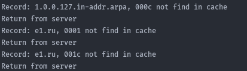
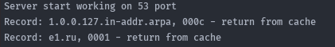

###Caching DNS server.

####
    Автор: Сагалов Леонид, КН-202, МЕН-280207

####
    Run: python start.server.py
    
####
    Утилита представляет собой DNS сервер с функцией кэширования. Изначально
    кэш пустой,сервер работает на 53 порту и получает от клиента запрос, 
    обрабатывает его. 
    
    Получив ответ, сервер пакет и вытаскивает из него всю полезную информацию.
    
    Затем сохраняет эту информацию в кэш. В процессе работы сервер валидирует кэш,
    удаляет из него все записи, чья актуальность исчерпана(истек ttl).
    
    При повторном запуске, сервер попытается восстановить актуальный кэш из
    бэкапа и продолжает штатную работу.

###
    1)Сервер запущен,кэш пустой.

    2)Сервер получил и обработал запрос.

    3)Сервер проинициализировал кэш и берет данные из него.

    

